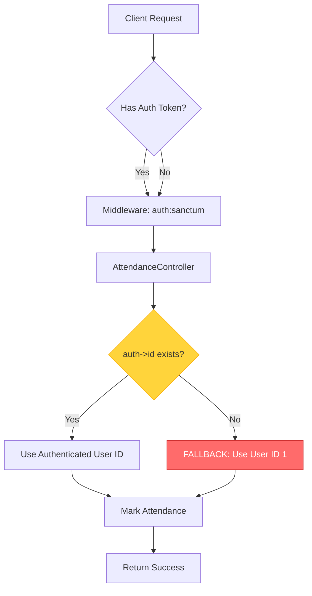
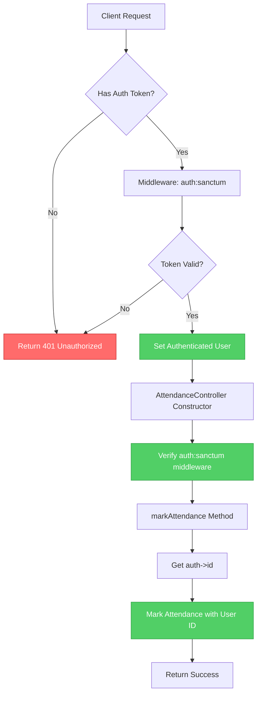
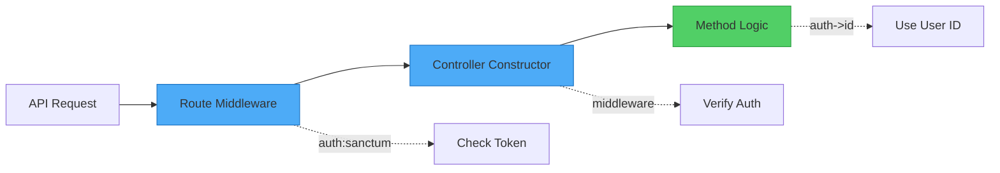

# Attendance Authentication Flow

## Current Flow (With Bug)



### Problems with Current Flow
1. **Security Bypass**: Unauthenticated requests can succeed with fallback user ID
2. **Data Integrity**: Attendance records incorrectly attributed to user ID 1
3. **Audit Trail**: Cannot track who actually marked attendance
4. **Misleading**: Middleware protection is bypassed by fallback logic

## Fixed Flow (Recommended)



### Benefits of Fixed Flow
1. ✅ **Proper Authentication**: All requests must have valid token
2. ✅ **Clear Error Handling**: 401 response for unauthenticated requests
3. ✅ **Accurate Audit Trail**: All records have correct user ID
4. ✅ **Defense in Depth**: Both route and controller level protection

## Authentication Layers



### Layer 1: Route Middleware
- Defined in `routes/api.php`
- Uses `auth:sanctum` middleware
- Returns 401 if token is missing or invalid

### Layer 2: Controller Constructor
- Defined in controller `__construct()` method
- Explicitly requires authentication
- Self-documenting and defensive

### Layer 3: Method Logic
- Uses `auth()->id()` directly
- No fallback needed
- Guaranteed to have authenticated user

## Code Comparison

### Before (Vulnerable)
```php
public function markAttendance(Request $request): JsonResponse
{
    // Validation...
    
    // PROBLEM: Fallback allows unauthenticated access
    $userId = auth()->id() ?? 1;
    
    // Mark attendance with potentially wrong user ID
    Attendance::updateOrCreate([...], [
        'marked_by' => $userId, // Could be 1 instead of real user
    ]);
}
```

### After (Secure)
```php
public function __construct()
{
    // Explicit authentication requirement
    $this->middleware('auth:sanctum');
}

public function markAttendance(Request $request): JsonResponse
{
    // Validation...
    
    // FIXED: No fallback, guaranteed authenticated user
    $userId = auth()->id();
    
    // Mark attendance with correct user ID
    Attendance::updateOrCreate([...], [
        'marked_by' => $userId, // Always the authenticated user
    ]);
}
```

## Error Response Examples

### Unauthenticated Request (No Token)
```json
{
    "success": false,
    "message": "Unauthenticated"
}
```
**HTTP Status**: 401 Unauthorized

### Invalid Token
```json
{
    "success": false,
    "message": "Unauthenticated"
}
```
**HTTP Status**: 401 Unauthorized

### Successful Request (With Valid Token)
```json
{
    "success": true,
    "message": "Attendance marked successfully"
}
```
**HTTP Status**: 200 OK

## Testing Scenarios

### Scenario 1: No Authentication Token
```bash
curl -X POST http://localhost:8000/api/attendance/mark \
  -H "Content-Type: application/json" \
  -d '{"division_id": 1, "attendance_date": "2026-02-17", "attendance": [...]}'
```
**Expected**: 401 Unauthorized

### Scenario 2: Invalid Token
```bash
curl -X POST http://localhost:8000/api/attendance/mark \
  -H "Authorization: Bearer invalid_token_here" \
  -H "Content-Type: application/json" \
  -d '{"division_id": 1, "attendance_date": "2026-02-17", "attendance": [...]}'
```
**Expected**: 401 Unauthorized

### Scenario 3: Valid Token
```bash
curl -X POST http://localhost:8000/api/attendance/mark \
  -H "Authorization: Bearer valid_token_here" \
  -H "Content-Type: application/json" \
  -d '{"division_id": 1, "attendance_date": "2026-02-17", "attendance": [...]}'
```
**Expected**: 200 OK with success message

## Database Impact

### Before Fix
```sql
-- Attendance records with fallback user ID
SELECT * FROM attendance WHERE marked_by = 1;
-- Returns records that may not actually be marked by user 1
```

### After Fix
```sql
-- All attendance records have correct user ID
SELECT a.*, u.name as marked_by_name 
FROM attendance a 
JOIN users u ON a.marked_by = u.id;
-- Returns accurate audit trail
```

## Summary

The fix ensures that:
1. 🔒 All attendance operations require valid authentication
2. 📝 Audit trails are accurate and trustworthy
3. ✅ Error messages are clear and appropriate
4. 🛡️ Multiple layers of protection prevent bypass
5. 🎯 Code is clean, maintainable, and self-documenting
