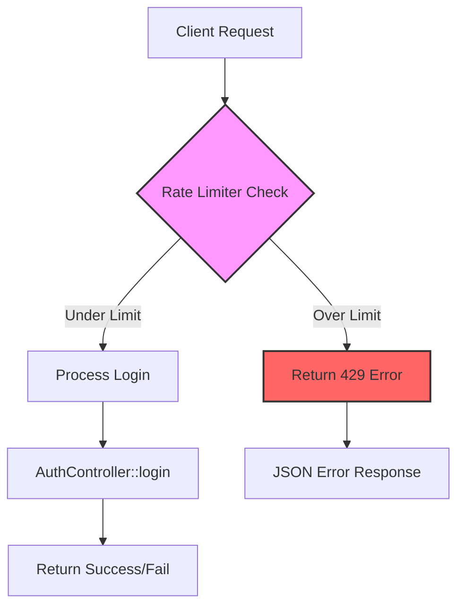

# Login Rate Limiting Implementation Plan

## Overview
Add rate limiting to the login endpoint to prevent brute force attacks by limiting login attempts to 5 per minute per IP address.

## Current State Analysis

### Authentication Setup
- **Controller**: [`AuthController`](../app/Http/Controllers/Api/AuthController.php:58)
- **Login Method**: [`login()`](../app/Http/Controllers/Api/AuthController.php:58)
- **Route**: POST `/api/login` defined in [`routes/api.php`](../routes/api.php:65)
- **Authentication**: Laravel Sanctum
- **Current Protection**: None - no rate limiting currently applied

### Route Configuration
```php
// Current route (line 65 in routes/api.php)
Route::post('/login', [AuthController::class, 'login']);
```

## Implementation Strategy

### Approach: Laravel Throttle Middleware
We'll use Laravel's built-in throttle middleware which provides:
- IP-based rate limiting
- Automatic retry-after headers
- Proper JSON error responses
- Redis/Cache-based tracking

### Architecture Diagram



## Implementation Steps

### Step 1: Configure Rate Limiter in AppServiceProvider

**File**: [`app/Providers/AppServiceProvider.php`](../app/Providers/AppServiceProvider.php)

**Action**: Add custom rate limiter named "login" in the `boot()` method

**Code to Add**:
```php
use Illuminate\Cache\RateLimiting\Limit;
use Illuminate\Support\Facades\RateLimiter;
use Illuminate\Http\Request;

public function boot(): void
{
    // Configure login rate limiter
    RateLimiter::for('login', function (Request $request) {
        return Limit::perMinute(5)->by($request->ip());
    });
}
```

**Explanation**:
- `RateLimiter::for('login', ...)` - Creates a named rate limiter called "login"
- `Limit::perMinute(5)` - Allows 5 attempts per minute
- `->by($request->ip())` - Tracks attempts by IP address
- Uses cache/Redis to store attempt counts

### Step 2: Apply Throttle Middleware to Login Route

**File**: [`routes/api.php`](../routes/api.php:65)

**Current Code**:
```php
Route::post('/login', [AuthController::class, 'login']);
```

**Updated Code**:
```php
Route::post('/login', [AuthController::class, 'login'])
    ->middleware('throttle:login');
```

**Explanation**:
- `->middleware('throttle:login')` - Applies the "login" rate limiter we defined
- Middleware runs before the controller method
- Automatically returns 429 status when limit exceeded

### Step 3: Verify JSON Error Response

Laravel's throttle middleware automatically returns proper JSON responses for API routes. The response will be:

```json
{
    "message": "Too Many Attempts.",
    "exception": "Illuminate\\Http\\Exceptions\\ThrottleRequestsException"
}
```

**HTTP Status**: 429 Too Many Requests

**Headers Included**:
- `X-RateLimit-Limit`: 5
- `X-RateLimit-Remaining`: 0
- `Retry-After`: 60 (seconds)

## Testing Plan

### Manual Testing Steps

1. **Test Normal Login** (Under Limit)
   ```bash
   # Should succeed for first 5 attempts
   curl -X POST http://127.0.0.1:8000/api/login \
     -H "Content-Type: application/json" \
     -d '{"email":"test@example.com","password":"password"}'
   ```

2. **Test Rate Limit** (Exceed Limit)
   ```bash
   # 6th attempt should return 429
   # Run the above command 6 times rapidly
   ```

3. **Verify Response Headers**
   ```bash
   curl -i -X POST http://127.0.0.1:8000/api/login \
     -H "Content-Type: application/json" \
     -d '{"email":"test@example.com","password":"password"}'
   ```
   Check for: X-RateLimit-Limit, X-RateLimit-Remaining, Retry-After

4. **Test Different IPs**
   - Rate limit should be per IP
   - Different IPs should have separate counters

### Automated Testing

Create a test file: `tests/Feature/LoginRateLimitTest.php`

```php
<?php

namespace Tests\Feature;

use Tests\TestCase;
use Illuminate\Foundation\Testing\RefreshDatabase;

class LoginRateLimitTest extends TestCase
{
    public function test_login_rate_limit_blocks_after_five_attempts()
    {
        // Make 5 requests - should all go through
        for ($i = 0; $i < 5; $i++) {
            $response = $this->postJson('/api/login', [
                'email' => 'test@example.com',
                'password' => 'wrong-password'
            ]);
            
            // Should get 401 (unauthorized) not 429 (rate limited)
            $this->assertEquals(401, $response->status());
        }
        
        // 6th request should be rate limited
        $response = $this->postJson('/api/login', [
            'email' => 'test@example.com',
            'password' => 'wrong-password'
        ]);
        
        $response->assertStatus(429);
        $response->assertJsonStructure(['message']);
    }
}
```

## Security Considerations

### Strengths
✅ Prevents brute force attacks  
✅ IP-based tracking prevents single attacker  
✅ Automatic retry-after headers inform clients  
✅ No code changes needed in controller  
✅ Uses Laravel's battle-tested middleware  

### Limitations
⚠️ **Shared IPs**: Users behind same NAT/proxy share limit  
⚠️ **IP Spoofing**: Attackers can rotate IPs  
⚠️ **Distributed Attacks**: Multiple IPs can still attack  

### Additional Recommendations

1. **Add Email-Based Rate Limiting** (Future Enhancement)
   ```php
   RateLimiter::for('login', function (Request $request) {
       $email = $request->input('email');
       return [
           Limit::perMinute(5)->by($request->ip()),
           Limit::perMinute(3)->by($email), // Additional email-based limit
       ];
   });
   ```

2. **Account Lockout** (Future Enhancement)
   - Lock account after X failed attempts
   - Require email verification to unlock
   - Implement in AuthController

3. **Logging & Monitoring**
   - Log rate limit violations
   - Alert on suspicious patterns
   - Track by IP and email

4. **CAPTCHA Integration** (Future Enhancement)
   - Add CAPTCHA after 3 failed attempts
   - Prevents automated attacks

## Configuration Options

### Adjustable Parameters

**Rate Limit Count**:
```php
Limit::perMinute(5)  // Change 5 to desired number
```

**Time Window**:
```php
Limit::perMinute(5)   // Per minute
Limit::perHour(20)    // Per hour
Limit::perDay(100)    // Per day
```

**Tracking Key**:
```php
->by($request->ip())                    // By IP
->by($request->input('email'))          // By email
->by($request->ip() . $request->email)  // Combined
```

### Environment-Based Configuration

Add to `.env`:
```env
LOGIN_RATE_LIMIT=5
LOGIN_RATE_WINDOW=1  # minutes
```

Update AppServiceProvider:
```php
RateLimiter::for('login', function (Request $request) {
    $limit = config('app.login_rate_limit', 5);
    $window = config('app.login_rate_window', 1);
    
    return Limit::perMinutes($window, $limit)->by($request->ip());
});
```

## Files to Modify

| File | Action | Lines |
|------|--------|-------|
| [`app/Providers/AppServiceProvider.php`](../app/Providers/AppServiceProvider.php) | Add rate limiter configuration | ~20-30 |
| [`routes/api.php`](../routes/api.php:65) | Apply throttle middleware | 65 |

## Expected Behavior

### Before Rate Limit (Attempts 1-5)
```
Request → Rate Limiter → Controller → Response (200/401)
Headers: X-RateLimit-Remaining: 4, 3, 2, 1, 0
```

### After Rate Limit (Attempt 6+)
```
Request → Rate Limiter → 429 Response (Controller not reached)
Headers: Retry-After: 60
```

### After Wait Period
```
Request → Rate Limiter (counter reset) → Controller → Response
Headers: X-RateLimit-Remaining: 5
```

## Rollback Plan

If issues occur, simply remove the middleware:

```php
// Revert to original
Route::post('/login', [AuthController::class, 'login']);
```

No database changes or migrations needed - completely reversible.

## Success Criteria

✅ Login endpoint limited to 5 attempts per minute per IP  
✅ 6th attempt returns 429 status code  
✅ Proper JSON error response returned  
✅ Rate limit headers included in response  
✅ No impact on successful logins under limit  
✅ Rate limit resets after 1 minute  
✅ Different IPs have independent limits  

## Timeline

- **Step 1**: Update AppServiceProvider (5 minutes)
- **Step 2**: Update routes/api.php (2 minutes)
- **Step 3**: Manual testing (10 minutes)
- **Step 4**: Documentation (5 minutes)

**Total**: ~20-25 minutes

## Next Steps

After reviewing this plan:

1. **Approve the approach** - Confirm the 5 per minute limit is appropriate
2. **Switch to Code mode** - Implement the changes
3. **Test the implementation** - Verify rate limiting works
4. **Monitor in production** - Watch for any issues

## Questions to Consider

1. Is 5 attempts per minute the right limit for your use case?
2. Should we also add email-based rate limiting?
3. Do you want environment-based configuration?
4. Should we add logging for rate limit violations?
5. Do you need CAPTCHA integration after X attempts?

---

**Ready to implement?** Switch to Code mode to apply these changes.
